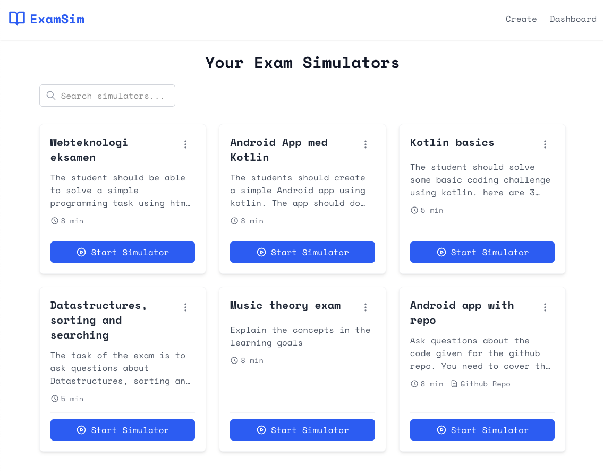

# Code Review Simulator

A research tool developed as part of the AiA (AI in Action) research project, designed to examine AI competences in Danish SMBs with a focus on critical reflection about socio-technical implications of AI-based code review.



## Research Context

This simulator serves as a design probe in an experiment investigating the implications of replacing traditional code review with AI-based code review. Key research questions include:

- How does AI-based code review affect code quality?
- What are the socio-technical implications of this transition?
- Does AI-based code review impact team communication and knowledge sharing?
- How does it affect developers' understanding of the codebase?
- What are the broader implications for software development practices?

## Features

- **Dynamic Review Environments**: Simulate various code review scenarios and contexts
- **Customizable Review Styles**: Experience different AI review approaches and personalities
- **Real-time Feedback**: Receive immediate code review suggestions and comments
- **Adjustable Review Parameters**: Configure review depth, focus areas, and style
- **Quality Assessment**: Evaluate the impact of AI review on code quality
- **Team Dynamics Analysis**: Study effects on team communication and knowledge sharing

## Setup

### Prerequisites

- Node.js (v14 or later)
- npm or yarn
- Chrome browser (recommended for optimal experience)

### Getting Started

1. Clone this repository to your local machine
   ```bash
   git clone https://github.com/behu-kea/Code-review-simulator.git
   cd code-review-simulator
   ```
2. Get a Google Gemini API key and an OpenAI key

   - Visit: https://aistudio.google.com/apikey Follow the instructions to create your API key
   - Visit: https://platform.openai.com/settings/organization/api-keys to get an OpenAI key

3. Create a `.env` file and add the keys to the .env file in the project root.

4. Install dependencies and start the application

```
npm install
npm run start
```

5. Open the application in your browser

- The development server will typically start at http://localhost:3000
- You can find the exact URL in your terminal output

## Usage

1. From the dashboard, select a code review scenario or create a custom review session
2. Configure review parameters (depth, focus areas, style)
3. Submit code for review and analyze AI feedback
4. Evaluate the quality and relevance of the review
5. Document observations about the impact on team dynamics and code understanding

## Contributing

This project is part of ongoing research. Please contact the research team if you're interested in contributing or participating in the study.
